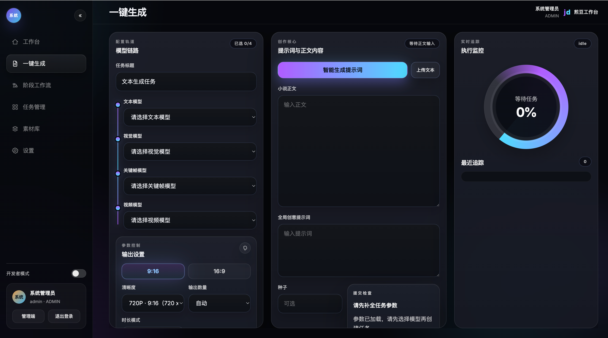
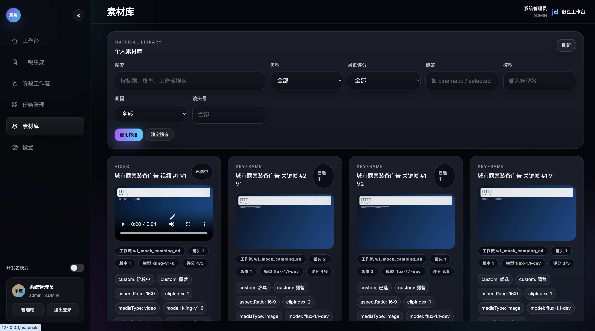

# JianDou（煎豆）

JianDou（煎豆）是一个面向短剧内容生产的 AI 文本到视频工作台。项目当前提供用户前台、独立后台和基于 Spring Boot 3 的后端服务，用于串联文本输入、阶段工作流、任务追踪和结果管理。

## 项目截图

工作台首页



阶段工作流与版本查看



## 功能概览

- 文本输入、TXT 上传与生成任务创建
- 阶段工作流管理：文本分镜、关键帧、视频生成
- 任务状态追踪与常用运维动作：暂停、继续、重试、终止
- 统一生成能力接口：模型目录、运行任务、用量查询
- 结果、日志、素材与本地存储管理
- Web 前台、独立 Admin 后台与 Spring Boot 3 后端分离运行

## 快速开始

### 快速开始前

- Node.js `>= 18`
- JDK `17`
- Maven `3.9+`
- MySQL `8.x`
- 将 `config/model/providers.secrets.yml` 中的示例 Key 替换为你自己的有效配置

详细环境准备与配置说明见：[使用文档](./docs/USER_GUIDE.md)、[大模型配置清单](./docs/MODEL_CONFIG_CHECKLIST.md)

### 当前技术入口

- 用户前台：`apps/web`
- 独立后台：`apps/admin`
- 当前唯一后端：`apps/api-spring`

### 本地开发启动

```bash
npm --prefix apps/web install
npm --prefix apps/admin install
npm run dev
```

说明：

- `npm run dev` 会启动 Web 前台和 Spring Boot 后端
- 如需单独启动后台管理端，可执行 `npm run admin:dev`

### Docker / 部署入口

本地 Docker 编排：

```bash
docker compose up --build
```

生产部署请参考：[Docker 部署文档](./docs/DEPLOY_DOCKER.md)

## 常用命令

```bash
npm run dev
npm run web:dev
npm run admin:dev
npm run api:dev
npm run web:build
npm run admin:build
```

- `npm run dev`：启动 Web 前台与 Spring Boot 后端
- `npm run web:dev`：仅启动前台
- `npm run admin:dev`：仅启动独立后台
- `npm run api:dev`：仅启动 Spring Boot 后端
- `npm run web:build`：构建前台
- `npm run admin:build`：构建后台

## 项目结构

```text
apps/
  web/         用户前台
  admin/       独立后台管理端
  api-spring/  Spring Boot 3 后端
config/        运行配置、模型配置、提示词配置
docs/          项目文档
storage/       上传文件、生成产物、临时文件
```

## 文档导航

### 使用与部署

- [使用文档](./docs/USER_GUIDE.md)：环境准备、本地启动、典型使用流程
- [Docker 部署](./docs/DEPLOY_DOCKER.md)：服务器部署与生产编排
- [大模型配置清单](./docs/MODEL_CONFIG_CHECKLIST.md)：模型 Provider、Key、配置项说明

### 架构与接口

- [架构说明](./docs/ARCHITECTURE.md)：系统结构、运行时链路、核心组件
- [Spring 后端架构草图](./docs/SPRING_API_ARCHITECTURE.md)：Spring 分层与运行链路
- [API 文档](./docs/API.md)：当前接口入口与请求示例
- [Python 到 Spring 迁移台账](./docs/PYTHON_TO_SPRING_MIGRATION_BACKLOG.md)：迁移背景与当前状态

### 路线与变更

- [路线图](./docs/ROADMAP.md)：后续规划
- [版本记录](./docs/CHANGELOG.md)：版本变更历史
- [功能开发记录](./docs/DEVELOPMENT_LOG.md)：迭代背景、改动与验证记录

## 社区与支持

- QQ 交流群：`1090387362`

## Star History

<a href="https://www.star-history.com/?repos=imi4u36d%2FJianDou&type=date&legend=top-left">
  <picture>
    <source media="(prefers-color-scheme: dark)" srcset="https://api.star-history.com/chart?repos=imi4u36d/JianDou&type=date&theme=dark&legend=top-left" />
    <source media="(prefers-color-scheme: light)" srcset="https://api.star-history.com/chart?repos=imi4u36d/JianDou&type=date&legend=top-left" />
    
  </picture>
</a>

## License

本项目采用仓库内的 [License](./License)。
