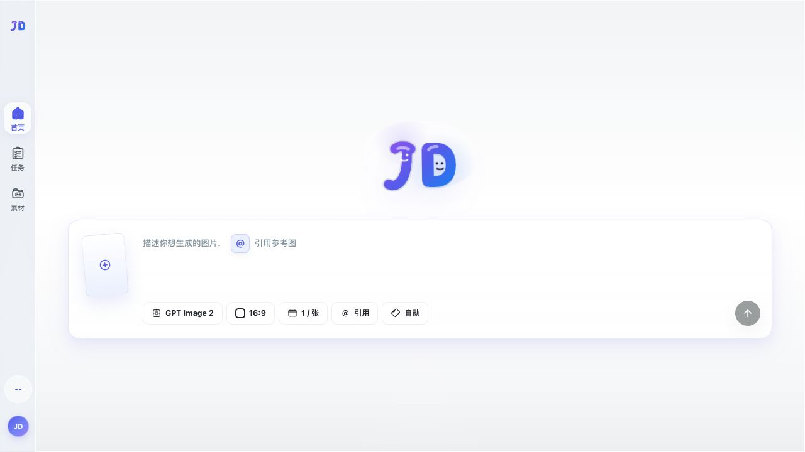
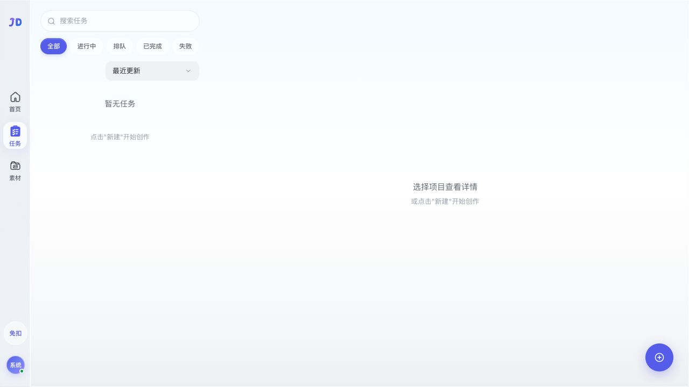
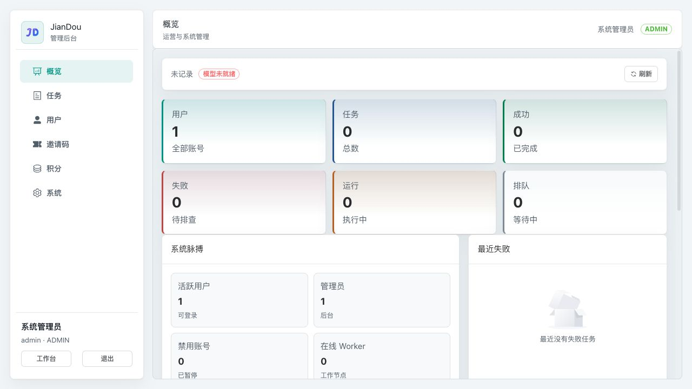

<p align="center">
  <strong>English</strong> | <a href="README_zh-CN.md">简体中文</a> | <a href="README_ja-JP.md">日本語</a>
</p>

<p align="center">
  
</p>

<h1 align="center">JianDou (煎豆)</h1>

<p align="center">
  An open-source text-to-video workstation powered by a configurable multi-model pipeline.
</p>

<p align="center">
  <a href="https://github.com/imi4u36d/JianDou/blob/main/License"></a>
  <a href="https://github.com/imi4u36d/JianDou/releases"></a>
  <a href="https://github.com/imi4u36d/JianDou"></a>
  <a href="https://github.com/imi4u36d/JianDou"></a>
</p>

---

Upload novel chapters, paste text, or enter a prompt — JianDou turns your words into video through a chain of configurable AI models (text, visual, keyframe, and video). Each stage can be independently assigned to different providers and model versions, giving you full control over the generation pipeline.

## Screenshots

| Image generation workspace | Task list and polling view | Admin overview |
|---|---|---|
|  |  |  |

## Key Features

**Flexible Input**
- Upload `.txt` files or paste text directly — content is automatically extracted for prompt generation.
- Enter custom prompts for full creative control.
- Attach reference images as the first or last keyframe.

**Multi-Model Pipeline**
- Four independently configurable stages: Text Model (script/storyboard) → Visual Model (reference image understanding) → Keyframe Model (first/last frame generation) → Video Model (video synthesis).
- Text and image generation are standardized on OpenAI GPT models; video generation keeps the existing video providers.
- Output parameters (aspect ratio, resolution, duration, count, seed) are dynamically filtered by the selected model's capabilities.

**Task Management**
- Real-time progress tracking with stage-level status, elapsed time, and video preview.
- Full task lifecycle: create, filter, detail view, retry, pause, resume, abort, delete, and rate.
- Seed management: automatically collect high-rated seeds and one-click backfill for consistent results.

**Admin Console**
- Dedicated admin portal separated from the user-facing frontend.
- Role-based access control (admin / user) with invite-code registration.
- Designed for content production teams and ops management.

**Security & Deployment**
- Rate limiting on auth endpoints, origin validation, encrypted API key storage.
- Docker Compose deployment with app, MySQL 8.0, Redis 7, automatic migrations, seed data, and health checks.
- Comprehensive configuration via environment variables and YAML files.

## Architecture

```
Text Input --> Text Model (script/storyboard generation)
                --> Visual Model (reference image understanding)
                        --> Keyframe Model (first/last frame generation)
                                --> Video Model (video synthesis)
                                        --> Preview / Download / Rate
```

Each pipeline stage is independently configurable with its own provider and model version.

## Quick Start

### Prerequisites

- **Python** 3.12+
- **Node.js** 20+
- **npm** (comes with Node.js)
- **[uv](https://docs.astral.sh/uv/)** (Python package manager)

### Option 1: Docker (Recommended)

```bash
# 1. Prepare environment
cp .env.docker.example .env.docker

# 2. Build and run app + MySQL + Redis
docker compose up --build
```

Docker Compose starts:
- `app` on http://localhost:8100
- `mysql:8.0` with database `jiandou`
- `redis:7-alpine` for shared rate limiting and short-lived API cache

The app container runs Alembic migrations and seed data on startup. Set `JIANDOU_AUTO_MIGRATE=false` to skip automatic migration and seeding.

### Option 2: Local Development

**Development mode** (two terminals):

```bash
# Terminal 1 — backend with hot-reload on :8100
bash scripts/dev-backend.sh

# Terminal 2 — frontend Vite HMR on :5173
bash scripts/dev-frontend.sh
```

**One-command production start** (builds frontend, migrates DB, seeds data, serves on :8100):

```bash
bash scripts/start.sh
```

Both scripts auto-create `.env` and `providers.secrets.yml` from templates if missing.
Edit `config/model/providers.secrets.yml` to add your API keys before using model features.

After startup:
- **User Frontend**: http://127.0.0.1:8100
- **Admin Portal**: http://127.0.0.1:8100/admin

### Health Checks

- **Liveness**: `GET /api/v3/health`
- **Readiness**: `GET /api/v3/ready` (validates database and storage availability)

## Model Configuration

Model configuration lives in `config/model/`:

```
config/model/
├── models.yml                    # Available model definitions
├── providers/                    # Provider base configs (base_url, etc.)
│   ├── volcengine.yml
│   ├── agnes.yml
│   └── openai.yml
├── providers.secrets.example.yml # API key template (committed)
└── providers.secrets.yml         # Your API keys (local, not committed)
```

Supported model providers:
- **OpenAI** — GPT text and GPT Image for script/storyboard and keyframe generation
- **Existing video providers** — Seedance/Agnes video generation remains available

## Configuration

All runtime settings are controlled via environment variables. See [docs/configuration.md](docs/configuration.md) for the full reference.

Key variables:

| Variable | Description | Default |
|---|---|---|
| `JIANDOU_SERVER_PORT` | Backend listen port | `8100` |
| `JIANDOU_DATABASE_URL` | Database connection string | `sqlite+aiosqlite:///./data/jiandou.db` |
| `JIANDOU_REDIS_URL` | Redis connection string for Docker/production | — |
| `JIANDOU_CACHE_BACKEND` | API cache backend: `memory` or `redis` | `memory` |
| `JIANDOU_RATE_LIMIT_BACKEND` | Auth rate limit backend: `memory` or `redis` | `memory` |
| `JIANDOU_SECRET_KEY` | JWT signing key | (must be set) |
| `JIANDOU_WEB_ORIGIN` | Frontend origin for CORS | `http://127.0.0.1:8100` |
| `JIANDOU_TRUSTED_ORIGINS` | Additional trusted origins (comma-separated) | — |
| `JIANDOU_COOKIE_SECURE` | Enable secure cookies + HSTS | `false` |
| `JIANDOU_WORKER_CONCURRENCY` | Async worker thread count (max 5) | `5` |
| `JIANDOU_DEFAULT_ASPECT_RATIO` | Default video aspect ratio | `16:9` |
| `JIANDOU_DEFAULT_DURATION_SECONDS` | Default video duration | `8` |

Authentication endpoints have built-in rate limiting. Tune via `JIANDOU_AUTH_LOGIN_RATE_LIMIT`, `JIANDOU_AUTH_INVITE_ACTIVATION_RATE_LIMIT`, and `JIANDOU_AUTH_RATE_LIMIT_WINDOW_SECONDS`.

## Development

### Frontend

The frontend is built with **Vue 3 + TypeScript + Element Plus + Tailwind CSS**, using Vite as the dev server with automatic API proxying.

```bash
# Dev server with HMR (default http://localhost:5173)
bash scripts/dev-frontend.sh

# Type checking
npm run web:typecheck

# Lint & format
npm run web:lint
npm run web:format

# Unit tests
npm run web:test

# Test coverage
npx vitest run --coverage
```

See [docs/frontend-architecture.md](docs/frontend-architecture.md) for the monorepo layout and component conventions.

### Backend

The backend is built with **FastAPI + SQLAlchemy + Alembic**. SQLite via aiosqlite remains the local default; MySQL via asyncmy is supported for Docker and production deployments.

```bash
# Backend dev server with hot-reload
bash scripts/dev-backend.sh

# Lint (ruff, zero errors expected)
uv run ruff check backend/

# Run all tests
uv run pytest

# Run by test category
uv run pytest -m unit      # Fast unit tests (64)
uv run pytest -m api       # API endpoint tests (90)
uv run pytest -m domain    # Domain layer tests (33)
uv run pytest -m "not slow" # Skip slow tests

# Export OpenAPI schema
uv run jiandou openapi --output docs/openapi.json
```

See [docs/backend-architecture.md](docs/backend-architecture.md) for module ownership and [docs/database-design.md](docs/database-design.md) for schema constraints.

### Verification

```bash
# Full test suite (backend lint + tests + frontend typecheck)
npm test

# Verify migrations against a fresh temporary database
TMP_DB=$(mktemp -t jiandou.XXXXXX.db) && \
  JIANDOU_DATABASE_URL="sqlite+aiosqlite:///$TMP_DB" uv run alembic upgrade head && \
  rm -f "$TMP_DB"

# Package type checks
npm run packages:typecheck
npm run web:typecheck

# Release preflight (cleans generated artifacts)
npm run release:check
```

## Documentation

| Document | Description |
|---|---|
| [Configuration](docs/configuration.md) | Full environment variable reference |
| [Backend Architecture](docs/backend-architecture.md) | Module ownership and change boundaries |
| [Frontend Architecture](docs/frontend-architecture.md) | Monorepo layout and component conventions |
| [Database Design](docs/database-design.md) | Schema constraints and migration rules |
| [Release Process](docs/release-process.md) | Versioning and release workflow |
| [Changelog](CHANGELOG.md) | Project changelog |
| [API Reference](docs/openapi.json) | OpenAPI 3.1 specification (generated) |

## Community & Support

- **QQ Group**: `1090387362`
- [Report a Bug / Request a Feature](https://github.com/imi4u36d/JianDou/issues)
- For security issues, see [SECURITY.md](SECURITY.md)
- For usage questions and contribution guidelines, see [SUPPORT.md](SUPPORT.md) and [CONTRIBUTING.md](CONTRIBUTING.md)

## Star History

<a href="https://www.star-history.com/?repos=imi4u36d%2FJianDou&type=date&legend=top-left">
  <picture>
    <source media="(prefers-color-scheme: dark)" srcset="https://api.star-history.com/chart?repos=imi4u36d/JianDou&type=date&theme=dark&legend=top-left" />
    <source media="(prefers-color-scheme: light)" srcset="https://api.star-history.com/chart?repos=imi4u36d/JianDou&type=date&legend=top-left" />
    
  </picture>
</a>

## License

This project is licensed under the [Apache License 2.0](./License).
