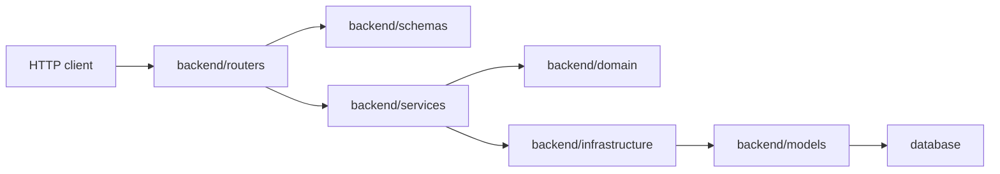

# Backend Architecture

This document is a map for contributors changing the Python backend. It describes where behavior belongs and which boundaries should stay stable.

Project-wide extraction rules, line-count ratchets, and the next frontend/backend batches are documented in [Maintainability Guide](maintainability.md).

## Request Flow

`backend/main.py` creates the FastAPI app, wires shared services into `app.state`, registers routers, installs security middleware, and starts the worker runner when enabled.

## Module Responsibilities

- `backend/routers`: HTTP boundary only. Parse request data, require authentication/authorization, call application services, and translate known exceptions to HTTP responses.
- `backend/schemas`: Pydantic request/response contracts. Keep wire naming and validation here instead of spreading camelCase/snake_case conversions through services.
- `backend/services`: application orchestration. Services own use cases, persistence coordination, provider calls, and view mapping.
- `backend/domain`: pure domain rules and value helpers. Prefer this layer for status classification, JSON normalization, queue ordering, media result parsing, and calculations that do not need I/O.
- `backend/infrastructure`: persistence adapters and repository-style boundaries. Keep SQLAlchemy row assembly and database mutation details out of routers.
- `backend/models`: SQLAlchemy ORM schema. Tables and columns must have comments, and core state strings must have database constraints.
- `backend/auth.py`: authentication helpers, cookie handling, DB-backed current-user lookup, and admin/user dependency checks.
- `backend/config.py`: environment-backed settings with structured `validate_settings()` diagnostics and production safety validation.
- `backend/container.py`: lazy dependency-injection container (`AppContainer`) that wires all services, repositories, and model providers.  Replaces the ad‑hoc manual wiring that was previously done inside `main.py`.
- `backend/exceptions.py`: centralized exception hierarchy (`JianDouError` base with `AuthError`, `GenerationError`, `TaskError`, etc.).  Backward‑compatible aliases exist for the legacy names.
- `backend/errors.py`: standardized HTTP error helpers (`not_found()`, `bad_request()`, `unauthorized()`, `forbidden()`, `bad_gateway()`, etc.) used consistently across all routers.
- `backend/shared.py`: unified utility module (string helpers, numeric coercions, JSON helpers, nested accessors, date helpers) that eliminated ~80 duplicated function definitions across 30+ files.
- `backend/logging_config.py`: centralized logging configuration with optional structured JSON output.
- `backend/middleware/`: extracted HTTP middleware (origin guard, security headers, SPA fallback) — previously inlined in `main.py`.
- `backend/__main__.py`: CLI entry points for serving, migrations, seeding, and OpenAPI export.

## Ownership Rules

- Routers should not construct database rows or call provider APIs directly.
- New business rules should live in `backend/domain` when they are pure, or `backend/services` when they need I/O or orchestration.
- Provider-specific response fallback order should stay in parser/helper modules with focused unit tests.
- New database columns need model comments, a migration, and tests when they introduce state, ranges, or ownership rules.
- User-facing reads and mutations must enforce owner boundaries unless they are explicit admin APIs.
- Admin-only behavior must use `backend.auth.require_admin()`.
- `backend.routers.admin` is the stable `/api/v3/admin` aggregation entrypoint. Task list, lifecycle, trace and diagnosis endpoints belong to `backend.routers.admin_task_routes`; additional admin domains should follow the same subrouter pattern instead of growing the aggregator.
- `backend.routers.workflows` is the stable `/api/v3/workflows` aggregation entrypoint. Storyboard, character-sheet, keyframe and video HTTP endpoints belong to `backend.routers.workflow_stage_routes`; service construction, credit/provider error translation and preference persistence shared by workflow subrouters belong to `backend.routers.workflow_route_support`.
- JWT cookies identify the subject only; authorization decisions must re-read `sys_user.status` and `sys_user.role`.
- `backend.services.auth_service.AuthService` remains the stable authentication facade. Login/session and administrative user lifecycle belong to `backend.services.auth_user_service.AuthUserService`; input and enum rules belong to `backend.services.auth_values`, while stable user response dictionaries belong to `backend.services.auth_presenters`. Invite creation, listing, expiry, revocation and activation belong to `backend.services.auth_invite_service.AuthInviteService`; invite codes use a cryptographically secure generator.

## Task And Worker Boundaries

Task creation and lifecycle commands enter through `TaskApplicationServiceImpl`, which delegates to query and command services. Queue enqueue lifecycle belongs to `TaskExecutionCoordinator` and command services because task row, attempt row, status history, and queue event mutations must remain consistent.

`backend.services.task_query_service.TaskQueryService` owns user read authorization, repository selection, pagination, detail and sub-collection query orchestration. Cache protocol adaptation, normalized list/trace keys and list-prefix invalidation belong to `backend.services.task_query_cache.TaskQueryCache`; pure task-type parsing, status matching and stable fallback ordering belong to `backend.services.task_query_policy`. Admin list filtering and dashboard overview aggregation belong to `backend.services.task_admin_query_service.TaskAdminQueryService`. Fallback conversion from an in-memory `TaskRecord` aggregate to list/detail API dictionaries belongs to `backend.services.task_query_presenters`; repository-native lightweight projections remain preferred when available.

`backend.services.credit_service.CreditService` remains the stable application facade for account creation, charging, refunds, adjustments, and rule mutation. Atomic balance changes and audit rows belong to `backend.services.credit_ledger.CreditLedger`; default-rule policy and rule persistence belong to `backend.services.credit_rule_catalog.CreditRuleCatalog`. Admin-facing user/account/usage aggregation belongs to `backend.services.credit_user_directory`; ORM credit records are converted to API dictionaries by the pure functions in `backend.services.credit_presenters`.

Worker-side queue inspection and claiming belong to `TaskQueueCoordinator`. It should expose worker queue operations such as claim, remove, and snapshots, not a separate enqueue shortcut.

Task diagnosis aggregate adaptation remains in `backend.services.task_diagnosis_service`; pure findings, severity, recovery and response projections belong to `backend.domain.task_diagnosis`. Worker queue claiming/removal/snapshots belong to `backend.services.task_queue_coordinator`, while immutable creation-time request snapshots belong to `backend.services.task_request_snapshot_factory`. The diagnosis service module re-exports both classes temporarily so existing container and test imports remain compatible.

Worker pipeline code should orchestrate, not accumulate all helper logic inline. Keep these boundaries in use:

- `backend.services.task_worker_pipeline_composition` for constructing the storyboard-preparation, status, render, video, workspace-image, runtime and artifact collaborator graph shared by `TaskWorkerPipelineHandler`.
- `backend.services.task_worker_pipeline_context` for pure task-kind checks, storyboard/character execution-context projections, scalar context mutation and generation-result extraction.
- `backend.domain.task_queue_fairness` for owner round-robin ordering.
- `backend.domain.task_monitoring` for task output and monitoring snapshots.
- `backend.domain.task_resume` for retry/resume clip continuity.
- `backend.services.task_execution_runtime_support` for dimensions, duration, output-count policy, active-attempt lookup, abort checks, and compatibility request methods.
- `backend.services.task_generation_request_factory` for script/image/character-sheet/workspace-image/video request payloads, model selection, deterministic image seeds, reference conversion, storage metadata, and user auth propagation.
- `backend.services.task_execution_prompt_support` for character-sheet, workspace-image, aspect-ratio, and bounded video prompt rules.
- `backend.services.task_reference_image_support` for deduplicating task references and converting local storage URLs into provider-compatible data URIs.
- `backend.services.task_worker_status_stage_service` for status, completion/failure, abort, and worker heartbeat mutation orchestration; `backend.services.task_worker_record_factory` for deterministic stage-run/model-call rows and provider call-chain trace projections.
- `backend.services.task_artifact_assembler` as the compatibility facade for task artifacts and text/video/joined material assembly.
- `backend.services.task_image_material_assembler` for keyframes, character sheets, workspace images and reused reference-frame normalization plus material metadata.
- `backend.services.task_artifact_storage` for best-effort task-directory materialization, fallback artifact naming, file inspection, and nested provider last-frame URL discovery.
- `backend.services.task_material_factory` for material-row storage metadata and thumbnail fields.
- `backend.services.task_result_assembler` for image, video, and joined-output result rows.
- `backend.services.task_artifact_support` for shared artifact naming, identifiers, and scalar coercion.
- `backend.services.task_worker_view_mapper` for task API view dictionaries.

`backend.domain.task_storyboard_planner.TaskStoryboardPlanner` remains the compatibility facade for structured storyboard planning. Character list/table schema detection, definition building and appearance-anchor extraction belong to `backend.domain.task_storyboard_characters.StoryboardCharacterParser`. Structured shot-table schema validation, continuous-frame parsing, character appearance injection, camera movement detection and prompt construction belong to `backend.domain.task_storyboard_shots.StoryboardShotPlanParser`. Clip-duration table extraction, total-duration distribution, provider-supported duration lookup and per-clip normalization belong to `backend.domain.task_storyboard_duration.StoryboardDurationPlanner`.

`backend.services.task_execution_coordinator.TaskExecutionCoordinator` remains the execution lifecycle and persistence-mutation facade. Queue membership changes, queue events and position recomputation belong to `backend.services.task_queue_lifecycle`; in-memory attempt state belongs to `backend.services.task_attempt_lifecycle`, while attempt persistence mutations and queue-event coupling belong to `backend.services.task_attempt_mutation_service`. Atomic task state, trace, history and attempt transitions belong to `backend.services.task_transition_service`. Trace, status-history, queue-event, and request-log row construction belongs to `backend.services.task_execution_record_factory`, while appending standalone records to the aggregate and assembling their `TaskPersistenceMutation` belongs to `backend.services.task_execution_mutation_recorder`; worker heartbeat row construction belongs to `backend.services.task_worker_registry`. Transition value objects and fluent construction belong to `backend.services.task_state_transition`; stale/orphaned running-claim discovery, worker heartbeat checks and re-enqueue mutation assembly belong to `backend.services.task_stale_claim_recovery`.

`backend.services.task_command_service.TaskCommandService` remains the task create/pause/resume/retry command facade. Generation-task construction, model validation, request snapshots, charging and initial persistence belong to `backend.services.task_creation_service`; append-only persistence mutations are combined by `backend.services.task_command_mutations`. Pure request trimming, task-type selection, scalar validation, output-count normalization and retry resume payload construction belong to `backend.services.task_command_inputs`; the facade keeps its private static aliases as compatibility seams for existing callers and tests.

`backend.services.workflow_auto_pilot.WorkflowAutoPilot` owns the execution loop, pause checks, and state persistence. Pure selection of the next storyboard, keyframe, video, wait, or finalization steps belongs to `backend.services.workflow_auto_pilot_planner.WorkflowAutoPilotPlanner`; serial step dispatch, batch concurrency, isolated sessions, and transient-provider retry belong to `backend.services.workflow_auto_pilot_executor.WorkflowAutoPilotStepExecutor`. The facade keeps `_compute_next_steps` as a compatibility seam for existing callers and tests.

`backend.services.task_worker_service.TaskWorkerPipelineHandler` orchestrates task loading, task-kind routing, render/video dispatch and terminal completion/failure. Script reuse or generation, model-call/material recording, storyboard parsing, output-count truncation, duration normalization and planning-context persistence belong to `backend.services.task_storyboard_preparation_service`. Workspace image generation belongs to `backend.services.task_workspace_image_service`; the domain-to-worker storyboard contract lives in `backend.services.task_storyboard_planner_adapter`; joined-output scheduling compatibility lives in `backend.services.join_output_service`. Concrete task video-stage orchestration remains in `backend.services.task_video_stage_service`; clip-context queries and mutations, duration/prompt resolution, frame publication, and resume lookup belong to `backend.services.task_video_stage_context`; successful clip model-call completion, material/result persistence and execution-context projection belong to `backend.services.task_video_clip_result_recorder`; provider run polling and terminal-result validation belong to `backend.services.task_video_run_service`; completed-clip concatenation and joined-result persistence belong to `backend.services.task_video_join_service`. The worker and video-stage facades retain existing public methods so callers do not depend on the new file layout.

`backend.services.task_worker_render_stage_service` orchestrates per-clip keyframe continuity and persistence. Per-clip first/end-frame execution-context projection, progress updates, ordered frame-context replacement and terminal resume/video-field cleanup belong to `backend.services.task_render_stage_context`. Render request/result/frame value objects belong to `backend.services.task_render_stage_contracts`; continuity prompts and planning/render response dictionaries belong to `backend.services.task_render_stage_payloads`, which retains compatibility re-exports for established imports. Individual first/last-frame generation, model-call completion/failure recording, generated material persistence and reference-frame reuse belong to `backend.services.task_frame_render_service`. Character-sheet generation and stage-run tracing belong to `backend.services.task_character_sheet_render_service`; prompt-aware character reference ordering, provider reference-count limits, word-boundary matching, and reusable character-sheet discovery belong to the pure `backend.services.task_render_reference_selector` module.

Local media storage uses `backend.services.media_service.LocalMediaArtifactService` as its compatibility facade. Artifact value objects shared by collaborators belong to `backend.services.media_artifacts`; Pillow prompt-card drawing, font fallback and text layout belong to `backend.services.media_prompt_cards.LocalMediaPromptCardRenderer`. Image, remote-image and video thumbnail generation, frame extraction, cache versioning and thumbnail paths belong to `backend.services.media_thumbnails.LocalMediaThumbnailService`. Silent-video generation, stream-copy concatenation and re-encode fallback belong to `backend.services.media_video_operations.LocalMediaVideoService`. Text/binary persistence, data-URI conversion, remote publication, copying and materialization belong to `backend.services.media_artifact_storage.LocalMediaArtifactStorageService`; only storage path policy and compatibility delegation remain in the facade.

`backend.services.material_asset_service.MaterialAssetService` owns asset-library queries, ownership checks and transaction boundaries. External payload normalization, ORM field projection, legacy URL precedence and API response mapping belong to the pure `backend.services.material_asset_mapping` module; the service retains `to_view` as a compatibility alias.

## Workflow Boundaries

`WorkflowService` is the stable workflow facade. Lifecycle/query/rating/cleanup commands live in `workflow_lifecycle_commands.py`; storyboard/keyframe/video generation and selection commands live in `workflow_stage_commands.py`. The facade composes those command families and delegates specialized logic to:

- `backend.domain.workflow_storyboard_plan` for storyboard markdown parsing.
- `backend.services.workflow_generation_request_builder` for generation-service request payloads.
- `backend.services.workflow_generation_result_parser` for generation-service response validation and extraction.
- `backend.services.workflow_storyboard_generation_service` for storyboard validation, model calls, error translation, and version persistence.
- `backend.services.workflow_stage_mutation_service` for stage selection, frame selection, ratings, and transaction orchestration; `workflow_stage_mutation_store` owns its SQL reads and soft-delete writes, while `workflow_stage_mutation_policy` owns pure cascading-deletion and current-stage rules.
- `backend.services.workflow_keyframe_generation_service` for keyframe generation orchestration and model calls; `backend.services.workflow_keyframe_version_store` for workflow/version context reads, continuity dependencies and selected-version updates.
- `backend.services.workflow_keyframe_persistence` for generated keyframe material and stage-version rows.
- `backend.services.workflow_keyframe_support` for shared frame URL selection and character-sheet filtering.
- `backend.services.workflow_persistence_row_factory` for ORM row defaults.
- `backend.services.workflow_finalization_service` for selected-video assembly and final asset persistence.
- `backend.services.workflow_video_refresh_service` for asynchronous video-run synchronization.
- `backend.services.workflow_video_generation_service` for clip context resolution, frame validation, video model calls, and version persistence.
- `backend.services.workflow_view_mapper` for response dictionaries.

Material reuse must persist a workflow row before returning a workflow response because the frontend immediately navigates to detail routes.

## Model Configuration And Secrets

Platform provider defaults live under `config/model/`. Local platform secrets live in `config/model/providers.secrets.yml`, copied from the checked-in example and ignored by Git.

User-scoped provider keys live in `sys_user_model_credential.encrypted_api_key`. They are encrypted at rest using a key derived from `JIANDOU_SECRET_KEY`; legacy plaintext values remain readable so existing local deployments can migrate by re-saving credentials.

## Tests That Guard The Architecture

- `tests/test_database_metadata.py` checks table/column comments and core state constraints.
- `tests/test_database_constraints.py` checks database-level range and enum constraints.
- `tests/test_repository_hygiene.py` prevents tracked secrets, runtime databases, build outputs, and release-script drift.
- `tests/test_configuration_examples.py` keeps `backend.config.Settings`, `.env.*.example`, and `docs/configuration.md` aligned.
- Focused domain/service tests cover extracted helpers so large orchestration modules do not regain duplicated parsing and status logic.

Run `npm run release:check` before release-facing changes.

## Known Limitations

The following items are recognized technical debt. They work correctly today but would improve robustness, query performance, or maintainability if addressed.

### Timestamps stored as strings

All timestamp columns use `String(32)` storing ISO 8601 text instead of native `DateTime`. This keeps serialization explicit across application layers, but has trade-offs:

- Date-range queries require string comparison rather than native date arithmetic.
- The database cannot validate that a value is a real timestamp.
- Index-based ordering depends on lexicographic sort of the ISO format.

**Migration path:** Add a new Alembic migration that converts `String(32)` columns to `DateTime(timezone=True)`. This requires auditing every read/write site that currently handles raw strings.

### In-memory rate limiter

`SlidingWindowRateLimiter` stores state in process memory. It resets on restart and does not share state across multiple uvicorn workers. For single-process deployments this is fine; for multi-worker or horizontally-scaled production, swap the backing store to Redis or a similar shared cache.

### Large service modules

**Improved.** The remaining oversized service work is concentrated in repository/worker orchestration such as `task_repository.py`; model invocation, generation runs, model configuration, and workflow orchestration now use focused modules:

- `generation_run_support.py` owns generation-run envelopes, value normalization, model metadata, and artifact helpers. `generation_text_run_service.py` owns probe orchestration and the stable text entry points; `generation_script_run_service.py` owns script generation/adjustment transactions, while `generation_text_run_values.py` normalizes request identity/metadata and provider interactions. `generation_image_run_service.py` owns image orchestration. `generation_video_run_service.py` owns video submission and the stable refresh entrypoint; `generation_video_run_refresh.py` owns provider polling, permanent-error classification, success materialization, failure transitions and next-poll scheduling. `generation_provider_registry.py` owns lazy default provider singletons, while `generation_profile_presenters.py` converts runtime profiles and fallback profiles into the stable run-service dictionary contract. `generation_run_factory.py` invokes provider transports and delegates kind-specific run construction. `generation_service.py` is the application/persistence facade and re-exports the established factory contracts.
- `model_config_path_locator.py` owns filesystem configuration discovery, Spring-compatible location parsing and split-YAML collection. `model_invocation_config.py` owns prompt-template resolution and retains compatibility exports for the locator and located-config contract. `model_invocation.py` re-exports those public types while focusing on provider transports and invocation strategies.
- `model_invocation_text.py` owns OpenAI-compatible text-provider orchestration. Stable invocation/response records, provider and strategy protocols, and endpoint policy live in `model_invocation_text_contracts.py`; Chat Completions and Responses API request preparation lives in `model_invocation_text_strategies.py`; JSON/SSE request encoding, HTTP error handling, stream aggregation, and response decoding live in `model_invocation_text_transport.py`. The text module and `model_invocation.py` keep compatibility re-exports.
- `model_invocation_image.py` owns OpenAI-compatible text-to-image and image-to-image provider behavior. Stable request/result/protocol records live in `model_invocation_image_contracts.py`; JSON/multipart/binary transport, retry and error classification live in `model_invocation_image_transport.py`. The image module and `model_invocation.py` re-export the established names.
- `model_invocation_video.py` is the compatibility export surface. Seedance request/query behavior belongs to `model_invocation_video_seedance.py`, Agnes behavior to `model_invocation_video_agnes.py`, and provider selection to `model_invocation_video_composite.py`. Stable submission/query value objects and the provider protocol live in `model_invocation_video_contracts.py`; HTTP request encoding, error classification and task-response normalization live in `model_invocation_video_transport.py`. `model_invocation.py` remains the top-level compatibility facade across config, text, image, and video modules.
- `model_config_profiles.py` owns stable text/media runtime configuration value objects. `model_config_service.py` re-exports them for compatibility.
- `model_config_runtime.py` owns the cached runtime facade, model catalog lookup and compatibility helpers. Snapshot-to-text-profile construction belongs to `model_config_runtime_text.py`; snapshot-to-image/video-profile construction and empty media defaults belong to `model_config_runtime_media.py`. `model_config_runtime_snapshot.py` owns YAML discovery, overlay merging, cache invalidation, legacy path fallback, and fail-fast behavior. `model_config_runtime_credentials.py` owns environment credential lookup, user/global-default scope selection, sibling-provider fallback, endpoint overrides, and config-source attribution. `model_config_admin.py` owns platform catalog responses and secret persistence; `model_config_user.py` owns per-user response and credential-update orchestration, while `model_config_user_catalog.py` groups models/providers, resolves endpoints and projects per-user key readiness. `model_config_service.py` is now a compatibility-only facade.
- `model_config_credentials.py` owns user credential contracts, Fernet protection, legacy plaintext reads, provider endpoint overrides, and synchronous SQLAlchemy persistence. `model_config_service.py` re-exports the compatibility names.
- `model_config_contracts.py` owns admin/user response DTOs, key-update requests, and normalized update batches. `model_config_service.py` re-exports the public contracts for compatibility.
- `model_config_response_support.py` owns provider-key normalization, API-key preview overrides, readiness summaries, and model-kind ordering shared by admin and per-user services.
- `workflow_service.py` is the stable workflow application facade. Public lifecycle/query/rating/cleanup methods belong to `workflow_lifecycle_commands.py`, while storyboard/keyframe/video methods belong to `workflow_stage_commands.py`; inheritance preserves the established service API without rebuilding a pass-through wrapper layer. The construction order and shared dependency graph for lifecycle, query, generation, mutation, refresh and finalization collaborators belongs to `workflow_service_composition.py`. User-scoped text/image/video readiness validation belongs to `workflow_model_validator.py`; fault-tolerant material thumbnail generation belongs to `workflow_thumbnail_resolver.py`.
- `workflow_finalization_service.py` owns selected-clip materialization, concatenation fallback, final asset creation, and completion-state persistence.
- `workflow_video_refresh_service.py` owns asynchronous video-run polling, result synchronization, asset creation, and refreshed version selection.
- `workflow_keyframe_generation_service.py`, `workflow_keyframe_version_store.py`, `workflow_keyframe_persistence.py`, and `workflow_keyframe_support.py` separate generation/model calls, workflow and version persistence queries, row creation, and pure frame URL selection.
- `workflow_video_generation_service.py` owns clip lookup, model-visible frame validation, video generation requests, and generated version persistence.
- `workflow_storyboard_generation_service.py` owns transcript/model validation, storyboard generation error translation, and storyboard-version persistence.
- `workflow_stage_mutation_service.py` owns storyboard/keyframe/video selection, rating propagation, and commit boundaries. `workflow_stage_mutation_store.py` owns mutation-specific SQL access and soft deletion; `workflow_stage_mutation_policy.py` owns version deletion chains and current-stage recomputation.
- `workflow_lifecycle_service.py` owns workflow creation, material reuse, soft deletion, settings persistence, auto-pilot field transitions, and automatic-workflow charging.
- `workflow_query_service.py` owns workflow filtering, sorting, pagination, version/asset loading, video-refresh-aware detail reads, and summary/detail mapping.
- `task_repository_mapping.py` owns TaskRecord/ORM conversion, bounded request snapshots, and full/lightweight material response mapping. `task_repository_aggregate_loader.py` reconstructs complete TaskRecord aggregates and all child collections. `task_repository_queries.py` owns task-summary session scope, row/count queries and response assembly; `task_repository_summary_support.py` owns thumbnails, summary filters/sorting, active attempts, queue positions and owner batches. `task_repository_detail_queries.py` owns lightweight single-task detail plus trace/output/material responses; `task_repository_detail_collections.py` owns attempts, status history, stage runs and lightweight model-call rows. `task_repository_mutations.py` owns the aggregate transaction boundary, lock, write ordering, flush/commit and rollback; attempt/stage/model/material/result/worker lookup, field mapping, payload sanitization and upsert belong to `task_repository_entity_upserts.py`. `task_repository_queue.py` owns queue inspection/claim/removal plus worker health and stale-claim reads. `task_repository.py` retains session ownership, low-level row helpers, and the compatibility facade.

The remaining large files retain section headers and should continue to be split along stable collaborator boundaries rather than by arbitrary line count.

### Workflow router response typing

**Resolved.**  All 19 workflow endpoints now declare Pydantic `response_model` (`WorkflowDetailResponse`, `WorkflowActionResponse`, `WorkflowListResponse`).  The models use `ConfigDict(extra="allow")` so the service layer can return additional fields without breaking the schema.
