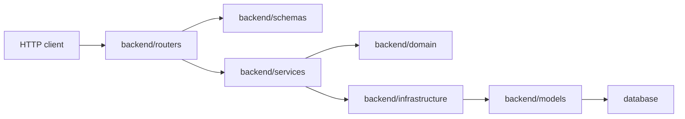

# Backend Architecture

This document is a map for contributors changing the Python backend. It describes where behavior belongs and which boundaries should stay stable.

## Request Flow

`backend/main.py` creates the FastAPI app, wires shared services into `app.state`, registers routers, installs security middleware, and starts the worker runner when enabled.

## Module Responsibilities

- `backend/routers`: HTTP boundary only. Parse request data, require authentication/authorization, call application services, and translate known exceptions to HTTP responses.
- `backend/schemas`: Pydantic request/response contracts. Keep wire naming and validation here instead of spreading camelCase/snake_case conversions through services.
- `backend/services`: application orchestration. Services own use cases, persistence coordination, provider calls, and view mapping.
- `backend/domain`: pure domain rules and value helpers. Prefer this layer for status classification, JSON normalization, queue ordering, media result parsing, and calculations that do not need I/O.
- `backend/infrastructure`: persistence adapters and repository-style boundaries. Keep SQLAlchemy row assembly and database mutation details out of routers.
- `backend/models`: SQLAlchemy ORM schema. Tables and columns must have comments, and core state strings must have database constraints.
- `backend/auth.py`: authentication helpers, cookie handling, DB-backed current-user lookup, and admin/user dependency checks.
- `backend/config.py`: environment-backed settings with structured `validate_settings()` diagnostics and production safety validation.
- `backend/container.py`: lazy dependency-injection container (`AppContainer`) that wires all services, repositories, and model providers.  Replaces the ad‑hoc manual wiring that was previously done inside `main.py`.
- `backend/exceptions.py`: centralized exception hierarchy (`JianDouError` base with `AuthError`, `GenerationError`, `TaskError`, etc.).  Backward‑compatible aliases exist for the legacy names.
- `backend/errors.py`: standardized HTTP error helpers (`not_found()`, `bad_request()`, `unauthorized()`, `forbidden()`, `bad_gateway()`, etc.) used consistently across all routers.
- `backend/shared.py`: unified utility module (string helpers, numeric coercions, JSON helpers, nested accessors, date helpers) that eliminated ~80 duplicated function definitions across 30+ files.
- `backend/logging_config.py`: centralized logging configuration with optional structured JSON output.
- `backend/middleware/`: extracted HTTP middleware (origin guard, security headers, SPA fallback) — previously inlined in `main.py`.
- `backend/__main__.py`: CLI entry points for serving, migrations, seeding, and OpenAPI export.

## Ownership Rules

- Routers should not construct database rows or call provider APIs directly.
- New business rules should live in `backend/domain` when they are pure, or `backend/services` when they need I/O or orchestration.
- Provider-specific response fallback order should stay in parser/helper modules with focused unit tests.
- New database columns need model comments, a migration, and tests when they introduce state, ranges, or ownership rules.
- User-facing reads and mutations must enforce owner boundaries unless they are explicit admin APIs.
- Admin-only behavior must use `backend.auth.require_admin()`.
- JWT cookies identify the subject only; authorization decisions must re-read `sys_user.status` and `sys_user.role`.

## Task And Worker Boundaries

Task creation and lifecycle commands enter through `TaskApplicationServiceImpl`, which delegates to query and command services. Queue enqueue lifecycle belongs to `TaskExecutionCoordinator` and command services because task row, attempt row, status history, and queue event mutations must remain consistent.

Worker-side queue inspection and claiming belong to `TaskQueueCoordinator`. It should expose worker queue operations such as claim, remove, and snapshots, not a separate enqueue shortcut.

Worker pipeline code should orchestrate, not accumulate all helper logic inline. Keep these boundaries in use:

- `backend.domain.task_queue_fairness` for owner round-robin ordering.
- `backend.domain.task_monitoring` for task output and monitoring snapshots.
- `backend.domain.task_resume` for retry/resume clip continuity.
- `backend.services.task_execution_runtime_support` for model request values and reference media resolution.
- `backend.services.task_worker_status_stage_service` for stage-run, model-call, status, and worker heartbeat mutations.
- `backend.services.task_artifact_assembler` for material/result row payloads.
- `backend.services.task_worker_view_mapper` for task API view dictionaries.

## Workflow Boundaries

`WorkflowService` owns workflow mutations and generation orchestration. It should delegate specialized logic to:

- `backend.domain.workflow_storyboard_plan` for storyboard markdown parsing.
- `backend.services.workflow_generation_request_builder` for generation-service request payloads.
- `backend.services.workflow_generation_result_parser` for generation-service response validation and extraction.
- `backend.services.workflow_persistence_row_factory` for ORM row defaults.
- `backend.services.workflow_view_mapper` for response dictionaries.

Material reuse must persist a workflow row before returning a workflow response because the frontend immediately navigates to detail routes.

## Model Configuration And Secrets

Platform provider defaults live under `config/model/`. Local platform secrets live in `config/model/providers.secrets.yml`, copied from the checked-in example and ignored by Git.

User-scoped provider keys live in `sys_user_model_credential.encrypted_api_key`. They are encrypted at rest using a key derived from `JIANDOU_SECRET_KEY`; legacy plaintext values remain readable so existing local deployments can migrate by re-saving credentials.

## Tests That Guard The Architecture

- `tests/test_database_metadata.py` checks table/column comments and core state constraints.
- `tests/test_database_constraints.py` checks database-level range and enum constraints.
- `tests/test_repository_hygiene.py` prevents tracked secrets, runtime databases, build outputs, and release-script drift.
- `tests/test_configuration_examples.py` keeps `backend.config.Settings`, `.env.*.example`, and `docs/configuration.md` aligned.
- Focused domain/service tests cover extracted helpers so large orchestration modules do not regain duplicated parsing and status logic.

Run `npm run release:check` before release-facing changes.

## Known Limitations

The following items are recognized technical debt. They work correctly today but would improve robustness, query performance, or maintainability if addressed.

### Timestamps stored as strings

All timestamp columns use `String(32)` storing ISO 8601 text instead of native `DateTime`. This works reliably for the current SQLite driver and avoids timezone driver quirks, but has trade-offs:

- Date-range queries require string comparison rather than native date arithmetic.
- The database cannot validate that a value is a real timestamp.
- Index-based ordering depends on lexicographic sort of the ISO format.

**Migration path:** Add a new Alembic migration that converts `String(32)` columns to `DateTime(timezone=True)`. This requires auditing every read/write site that currently handles raw strings.

### In-memory rate limiter

`SlidingWindowRateLimiter` stores state in process memory. It resets on restart and does not share state across multiple uvicorn workers. For single-process deployments this is fine; for multi-worker or horizontally-scaled production, swap the backing store to Redis or a similar shared cache.

### Large service modules

**Improved.**  Several service files exceed 1,000 lines (`model_config_service.py`, `generation_service.py`, `model_invocation.py`, `workflow_service.py`, `task_repository.py`).  They now carry section‑header comments (`# === TYPE DEFINITIONS ===`, `# === CONFIG RESOLVER ===`, etc.) that make navigation substantially easier.  Further splitting into sub‑modules remains an option for future contributors.

### Workflow router response typing

**Resolved.**  All 19 workflow endpoints now declare Pydantic `response_model` (`WorkflowDetailResponse`, `WorkflowActionResponse`, `WorkflowListResponse`).  The models use `ConfigDict(extra="allow")` so the service layer can return additional fields without breaking the schema.
